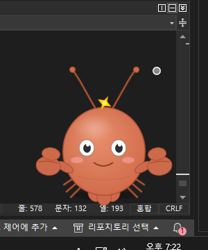
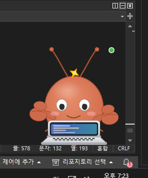
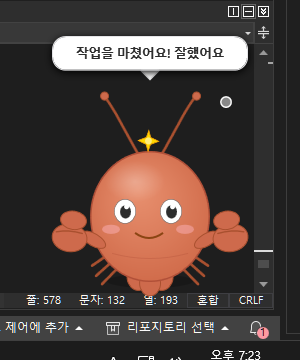
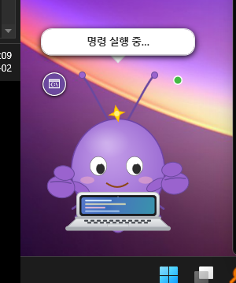
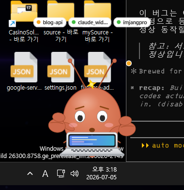
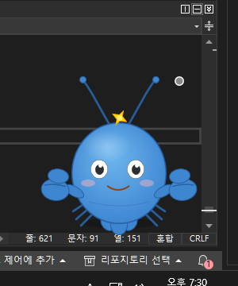

# 🦞 Claude Widget

Claude Code가 열심히 일하는 동안, 바탕화면 구석에서 함께 코딩해주는 작고 귀여운 가재 펫입니다.

## 📸 스크린샷

| 대기 중 | 작업 중 | 말풍선 | 툴 인식 |
|:---:|:---:|:---:|:---:|
|  |  |  |  |

**v1.3.0 — 멀티세션 인식 & 세션 대시보드**

| 세션 칩 스트립 (여러 세션 동시 인식) | 세션 대시보드 (비용·시간·시스템 자원) |
|:---:|:---:|
|  |  |

## ✨ 주요 기능

### 가재 디자인
Claude의 마스코트를 모티브로 한 게/가재 캐릭터입니다. Claude 특유의 테라코타 오렌지 몸통, 집게발, 더듬이, 더듬이 사이의 금빛 Claude 스파클(✦), 부채 모양 꼬리, 걸어다니는 작은 다리까지 갖췄습니다. 평소에는 숨쉬기·눈 깜빡임·주변 두리번거림·가끔의 통통 튐 같은 대기 애니메이션을 보여줍니다.

### Claude Code 실행 감지 (작업 모드)
`claude.exe` 네이티브 런처(`@anthropic-ai/claude-code` 패키지)와, 이를 구동하는 `node`/`bun`/`deno` 프로세스를 주기적으로 스캔해 Claude Code CLI가 실행 중인지 감지합니다. 감지되면 가재가 노트북을 펼치고 타이핑을 시작합니다(작업 모드). 실행 중이 아니면 다시 대기 상태로 돌아갑니다.

- **상태 점(도트)**: 회색 = 대기 중, 초록 = 작업 중, **앰버 = 확인 대기**(권한 등), 파랑(깜빡임) = 새 버전 있음. 클릭하면 **세션 대시보드**가 열립니다(업데이트가 있을 때는 클릭 시 자동 설치).

### 멀티세션 인식 & 세션 칩 스트립 *(v1.3.0)*
여러 개의 Claude Code 세션을 동시에 돌려도 위젯이 각각을 구분합니다. 훅 페이로드의 `session_id`로 세션을 격리 추적하고, 캐릭터 위에 **세션별 칩**(프로젝트명 + 상태 점)을 나열합니다. 대표 캐릭터는 전체 세션 중 **가장 급한 상태(권한 대기 > 작업 중 > 유휴)** 를 보여주므로, 어느 세션이든 확인이 필요하면 곧바로 알 수 있습니다. 칩을 클릭하면 해당 세션의 상세(프로젝트·상태·경과)를 말풍선으로 표시하고, 세션이 많으면 `+N` 칩으로 접힙니다.

### 세션 대시보드 (HUD) *(v1.3.0)*
상태 점 클릭 · `+N` 칩 · 우클릭 메뉴 **세션 대시보드 보기** 로 여는 카드형 패널입니다.
- **세션별**: 상태 · 경과 시간 · **예상 비용**(각 세션 transcript를 파싱한 토큰 사용량 기반 추정치 — 참고용 "예상" 값입니다).
- **하단 합계**: 실행 중인 Claude 프로세스의 **CPU·RAM 합계**, 오늘/누적 코딩 시간.

### 상태별 표정 *(v1.3.0)*
캐릭터가 상황에 따라 표정을 바꿉니다. 세션이 권한을 기다리면 **걱정하는 표정**(눈썹 + 입), 작업을 마치면 머리 위 스파클이 **반짝 축하**, 오래 유휴 상태면 눈을 감고 **Zzz 하며 졸기** 시작합니다.

### 테마 5종
우클릭 메뉴의 **테마**에서 즉시 바꿀 수 있습니다.
- 클로드 (주황) · 바다 (파랑) · 숲 (초록) · 포도 (보라) · 자정 (다크)



### 말풍선
작업 시작/완료, 인사말 등 다양한 순간에 말풍선으로 말을 겁니다. 우클릭 메뉴의 **말풍선 표시**로 켜고 끌 수 있습니다.

### 시스템 트레이
트레이 아이콘을 더블클릭하면 위젯을 보이기/숨기기 할 수 있고, 우클릭하면 보이기/숨기기·업데이트 확인·종료 메뉴가 나타납니다. 위젯은 작업 표시줄에는 버튼이 뜨지 않도록 설계되었습니다.

### 오늘의 기록 (사용 통계)
우클릭 메뉴의 **오늘의 기록 보기**로 오늘/누적 코딩 시간과 세션 수를 말풍선으로 확인할 수 있습니다(누적 시간은 세션 대시보드 하단에도 표시됩니다). 기록은 `%APPDATA%\ClaudeWidget\settings.json`에 저장되어 재시작 후에도 유지됩니다.

### 자동 업데이트
GitHub Releases를 기준으로 새 버전을 자동 확인하고, 클릭 한 번으로 조용히 설치까지 끝냅니다. 자세한 동작 방식은 [docs/AUTO_UPDATE.md](docs/AUTO_UPDATE.md)를 참고하세요.

### Claude CLI 알림 연동
Claude Code의 알림·작업 완료 메시지를 위젯의 말풍선으로 그대로 띄워줍니다. **v1.2.0부터는 한 걸음 더 들어가**, Claude가 지금 어떤 툴(파일 읽기·코드 수정·명령 실행 등)을 쓰고 있는지 아이콘 배지 + 짧은 말풍선으로 보여주는 **툴 인식**, 권한이 필요할 때 위젯이 좌우로 흔들리며 **트레이 풍선 알림**까지 띄우는 강화된 알림, 프롬프트 제출/세션 시작·종료에 반응하는 인사, 50분 연속 작업 시 살짝 건네는 **휴식 넛지**가 함께 추가되었습니다. 자세한 내용은 [docs/CLI_INTEGRATION.md](docs/CLI_INTEGRATION.md)를 참고하세요.

### 기타 조작
- **항상 위에 표시**: 다른 창 위에 항상 떠 있게 고정합니다.
- **Windows 시작 시 실행**: 로그인할 때 자동으로 켜집니다(관리자 권한 불필요).
- **크기**: 작게 / 보통 / 크게(0.7× / 1.0× / 1.4×) 세 단계.

## 📥 설치

1. [Releases 페이지](https://github.com/BaeTab/claude_widget_pet/releases)에서 최신 `ClaudeWidget_Setup_X.Y.Z.exe`를 다운로드합니다.
2. 실행 후 안내에 따라 설치합니다. **사용자 단위 설치라 관리자 권한이 필요 없습니다.**
   - 설치 중 바탕화면 바로가기, Windows 시작 시 자동 실행 여부를 선택할 수 있습니다.
3. 요구 사항: Windows 10/11 (x64). .NET이 이미 앱에 포함되어 있어(self-contained) 별도 설치가 필요 없습니다.

## 🖱️ 사용법

### 우클릭 메뉴
바탕화면의 가재를 우클릭하면 다음 메뉴가 나타납니다.

| 메뉴 | 설명 |
|---|---|
| 세션 대시보드 보기 | 세션별 상태·경과·예상 비용 + Claude 프로세스 CPU/RAM 합계를 카드로 표시 |
| 오늘의 기록 보기 | 오늘/누적 코딩 시간과 세션 수를 말풍선으로 표시 |
| 테마 | 클로드 / 바다 / 숲 / 포도 / 자정 중 선택 |
| 크기 | 작게 / 보통 / 크게 |
| 말풍선 표시 | 말풍선 on/off |
| 항상 위에 표시 | 항상-위-표시 on/off |
| Windows 시작 시 실행 | 로그인 시 자동 실행 on/off |
| 자동 업데이트 확인 | 자동 업데이트 확인 on/off |
| Claude CLI 알림 연동 | Claude Code 훅 연동 on/off ([자세히](docs/CLI_INTEGRATION.md)) |
| 작업 상세 표시 (툴 인식) | Claude가 쓰는 툴을 아이콘 배지로 표시 on/off (기본 켜짐) |
| 업데이트 확인 | 지금 바로 새 버전 확인 |
| 정보 | 현재 버전 표시 |
| 종료 | 위젯 종료 |

### 마우스 동작
- **왼쪽 버튼으로 드래그**: 원하는 위치로 이동(위치는 자동 저장되어 다음 실행에도 유지됩니다).
- **더블클릭**: 통통 튀는 리액션.
- **말풍선 클릭**: 해당 말풍선의 동작 수행(예: 업데이트 알림 클릭 시 설치 시작).
- **상태 점 클릭**: 세션 대시보드 열기(업데이트가 대기 중일 때는 설치 시작).
- **세션 칩 클릭**: 해당 세션의 상세를 말풍선으로 표시.

### 트레이 아이콘
- **더블클릭**: 위젯 보이기/숨기기.
- **우클릭**: 보이기/숨기기, 업데이트 확인, 종료.

## 🔄 자동 업데이트

위젯은 실행 시와 이후 6시간마다 GitHub Releases를 확인해, 새 버전이 있으면 상태 점이 파랗게 깜빡이고 "새 버전 vX.Y.Z 나왔어요!" 말풍선이 뜹니다. 클릭하면 설치 파일을 받아 조용히(`/SILENT`) 설치하고 자동으로 재실행됩니다. 자세한 내부 동작은 [docs/AUTO_UPDATE.md](docs/AUTO_UPDATE.md)를 참고하세요.

## 🔔 Claude CLI 알림 연동

우클릭 메뉴의 **Claude CLI 알림 연동**을 켜면, 위젯이 Claude Code의 훅(hook) 핸들러 역할을 겸하게 되어 `~/.claude/settings.json`에 필요한 항목을 안전하게 병합합니다. Claude Code가 알림을 보내거나 작업을 마치면 위젯이 말풍선으로 알려줍니다. 수동 설정 방법과 문제 해결은 [docs/CLI_INTEGRATION.md](docs/CLI_INTEGRATION.md)를 참고하세요.

## 🛠️ 소스에서 빌드

```bash
dotnet publish Claude_Widget/Claude_Widget.csproj -c Release -r win-x64 --self-contained true -o publish
```

설치 파일(Inno Setup 6 필요)을 만들려면:

```bash
ISCC setup.iss
# 또는 버전을 지정해서:
ISCC /DMyAppVersion=1.3.1 setup.iss
```

Visual Studio에서 Release 구성으로 빌드하면 MSBuild 타깃이 자동으로 `publish/` 폴더까지 게시해줍니다.

## 📁 설정 파일 위치

| 경로 | 내용 |
|---|---|
| `%APPDATA%\ClaudeWidget\settings.json` | 테마, 크기, 위치, 항상 위에 표시, 말풍선 on/off, 자동 업데이트 on/off, 작업 상세 표시(툴 인식) on/off, 사용 통계 |
| `%APPDATA%\ClaudeWidget\inbox\` | Claude CLI 알림 연동이 전달하는 임시 이벤트 파일(JSON) |

## 📄 라이선스

MIT License.
